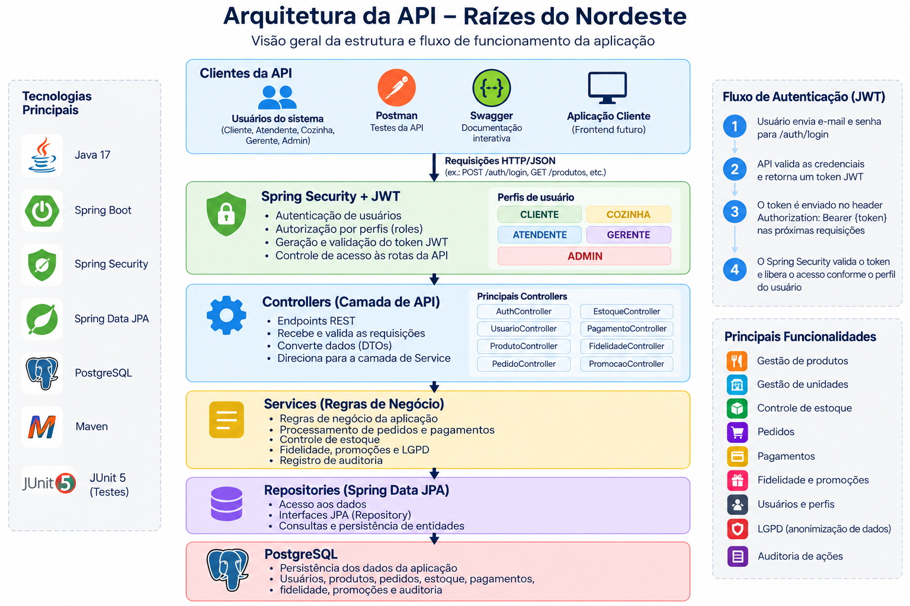
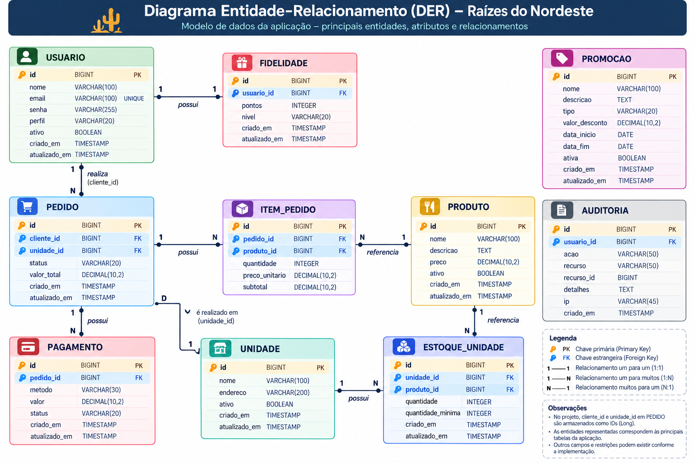

# Raízes do Nordeste API

Projeto desenvolvido para a disciplina de Projeto Multidisciplinar - Trilha Back-End da UNINTER.

A proposta é desenvolver uma API para uma rede de lanchonetes, permitindo controlar usuários, produtos, unidades, estoque, pedidos, pagamentos e outras funções necessárias para o funcionamento do sistema.

## Tecnologias utilizadas

- Java 17
- Spring Boot 4.1.1
- Spring Data JPA
- Spring Security
- PostgreSQL
- H2 para os testes
- JWT
- Maven
- Swagger / OpenAPI
- JUnit e MockMvc

## Funcionalidades

Até o momento a API possui:

- cadastro de usuários;
- login e autenticação com JWT;
- controle de acesso por perfil;
- cadastro de produtos;
- cadastro de unidades;
- controle de estoque por unidade;
- criação de pedidos;
- controle dos status dos pedidos;
- diferentes canais de pedido;
- simulação de pagamento aprovado ou recusado;
- programa de fidelidade;
- promoções;
- registro de auditoria;
- anonimização de usuário.

## Perfis de usuário

Foram definidos cinco perfis:

- `CLIENTE`
- `ATENDENTE`
- `COZINHA`
- `GERENTE`
- `ADMIN`

Cada perfil possui permissões diferentes dentro da API.

Por exemplo, operações administrativas como cadastro de produtos são restritas a gerente e administrador.

No cadastro público de usuário, o perfil criado é sempre `CLIENTE`. Dessa forma, não é possível utilizar o cadastro público para criar diretamente um usuário administrador.

## Autenticação

A autenticação foi implementada utilizando JWT.

O login é feito pelo endpoint:

```http
POST /auth/login
```

Exemplo:

```json
{
  "email": "usuario@exemplo.com",
  "senha": "senha"
}
```

Depois do login, a API retorna um token que deve ser utilizado nos endpoints protegidos:

```http
Authorization: Bearer TOKEN
```

As senhas cadastradas no sistema são armazenadas utilizando BCrypt.

## Pedidos

Um pedido possui:

- cliente;
- unidade;
- canal;
- itens;
- valor total;
- status.

Os canais disponíveis são:

```text
APP
TOTEM
BALCAO
PICKUP
WEB
```

Também é possível consultar os pedidos por canal.

Exemplo:

```http
GET /pedidos?canalPedido=APP
```

Ao criar um pedido, o sistema verifica se a unidade e os produtos existem e se existe estoque suficiente.

Se não houver estoque, a operação é recusada.

Quando o pedido é criado com sucesso, a quantidade comprada também é retirada do estoque da unidade.

## Status do pedido

Um pedido novo começa com:

```text
AGUARDANDO_PAGAMENTO
```

Quando o pagamento é aprovado, passa para:

```text
PAGO
```

Depois disso, o fluxo permitido é:

```text
PAGO
  ↓
EM_PREPARACAO
  ↓
PRONTO
  ↓
ENTREGUE
```

O sistema não permite avançar o pedido utilizando uma transição de status inválida.

Caso o pagamento seja recusado, o pedido recebe o status:

```text
PAGAMENTO_RECUSADO
```

## Estoque

O estoque é separado por unidade e produto.

Por exemplo, um mesmo produto pode possuir 20 unidades disponíveis em uma loja e 5 em outra.

O sistema verifica essa quantidade antes da criação do pedido.

Caso a quantidade solicitada seja maior que o estoque disponível, a API retorna `409 Conflict`.

## Pagamento

O pagamento foi implementado como uma simulação (mock), pois o projeto não utiliza uma operadora de pagamento real.

Existem dois resultados:

```text
APROVADO
RECUSADO
```

Um pagamento aprovado altera o pedido para `PAGO`.

Um pagamento recusado altera o pedido para `PAGAMENTO_RECUSADO`.

## Fidelidade

Também foi implementado um programa de fidelidade.

Ele permite:

- adesão do usuário;
- consulta dos pontos;
- adição de pontos;
- resgate;
- cancelamento do consentimento.

## Promoções

A API possui cadastro e gerenciamento de promoções.

Uma promoção possui informações como nome, descrição, percentual de desconto, período de validade e situação.

## Auditoria

Algumas operações importantes geram registros de auditoria.

Entre elas estão:

- criação de pedido;
- alteração do status do pedido;
- pagamento aprovado;
- pagamento recusado;
- anonimização de usuário.

Os registros armazenam a ação realizada, recurso relacionado, usuário responsável e data/hora.

A consulta da auditoria é restrita aos perfis `GERENTE` e `ADMIN`.

## LGPD

Alguns cuidados relacionados à proteção de dados foram aplicados no projeto.

As senhas não são armazenadas em texto puro e também não são retornadas nas respostas da API.

Foi criada ainda uma operação de anonimização de usuário. Essa operação substitui dados pessoais identificáveis sem precisar excluir registros necessários para o funcionamento do sistema.

A anonimização é permitida somente para administradores.

No programa de fidelidade também existe o controle de consentimento do usuário.

## Tratamento de erros

A API possui tratamento centralizado de erros.

Alguns códigos utilizados são:

| Código | Significado |
|---|---|
| 200 | Operação realizada |
| 201 | Recurso criado |
| 400 | Dados inválidos |
| 401 | Usuário não autenticado |
| 403 | Usuário sem permissão |
| 404 | Recurso não encontrado |
| 409 | Conflito com uma regra de negócio |

Exemplo de erro:

```json
{
  "timestamp": "2026-10-04T12:00:00",
  "status": 409,
  "erro": "Conflict",
  "mensagem": "Estoque insuficiente para o produto solicitado.",
  "path": "/pedidos"
}
```

## Configuração

O projeto utiliza variáveis de ambiente para não deixar informações sensíveis diretamente no código.

Exemplo:

```env
DB_URL=jdbc:postgresql://localhost:5432/raizes_nordeste
DB_USERNAME=postgres
DB_PASSWORD=sua_senha

JWT_SECRET=sua_chave_secreta
JWT_EXPIRATION_MS=3600000
```

Existe um arquivo `.env.example` na raiz do projeto com o modelo das variáveis necessárias.

Senhas reais e a chave JWT não devem ser enviadas para o repositório.

## Como executar

Clone o projeto:

```bash
git clone https://github.com/julianastefani/raizes-nordeste-api.git
```

Entre na pasta:

```bash
cd raizes-nordeste-api
```

Crie no PostgreSQL o banco:

```text
raizes_nordeste
```

Configure as variáveis de ambiente e execute o projeto.

Windows:

```bash
mvnw.cmd spring-boot:run
```

Linux/macOS:

```bash
./mvnw spring-boot:run
```

Por padrão, a aplicação será executada na porta `8080`.

## Swagger

Com a aplicação em execução, a documentação da API pode ser acessada em:

```text
http://localhost:8080/swagger-ui.html
```

A especificação OpenAPI também fica disponível em:

```text
http://localhost:8080/api-docs
```

Para testar os endpoints protegidos pelo Swagger é necessário realizar o login e informar o JWT na opção `Authorize`.

## Postman

Também foi disponibilizada uma coleção do Postman com os principais endpoints da API.

O arquivo da coleção está disponível na pasta:

```text
postman/
```

A coleção utiliza a variável `baseUrl` apontando para:

```text
http://localhost:8080
```

Após realizar o login, o token JWT pode ser utilizado nas demais requisições protegidas da API.

Para utilizar a coleção é necessário ter a aplicação em execução e utilizar credenciais válidas cadastradas no ambiente local.

## Testes

Os testes de integração utilizam JUnit, MockMvc e um banco H2 em memória separado do banco principal.

Atualmente existem 12 testes automatizados e todos estão passando.

Foram testados cenários como:

- login válido;
- acesso sem token (`401`);
- acesso sem permissão (`403`);
- pedido válido;
- campo obrigatório ausente;
- quantidade inválida;
- produto inexistente (`404`);
- estoque insuficiente (`409`);
- pagamento aprovado;
- pagamento recusado;
- registro de auditoria;
- inicialização do contexto da aplicação.

Para executar:

```bash
mvnw.cmd test
```

## Estrutura do projeto

Os principais pacotes são:

```text
config      -> configurações de segurança e JWT
controller  -> endpoints da API
dto         -> objetos de entrada de dados
enums       -> valores enumerados utilizados pelo sistema
exception   -> tratamento das exceções
model       -> entidades
repository  -> acesso ao banco de dados
service     -> regras de negócio
```

## Diagramas do projeto

Foram criados dois diagramas para representar a organização da aplicação e o modelo de dados utilizado no projeto.

### Arquitetura da API

O diagrama abaixo apresenta o fluxo geral da aplicação, desde o acesso à API até a persistência dos dados.



### Modelo de dados

O diagrama entidade-relacionamento (DER) apresenta as principais entidades utilizadas pela aplicação e seus relacionamentos.



## Scripts do banco de dados

Os scripts SQL utilizados para documentar e versionar a estrutura inicial do banco estão disponíveis em:

```text
src/main/resources/db/migration
```

Os arquivos disponíveis são:

- `V1__create_tables.sql` - criação das tabelas e relacionamentos;
- `V2__seed_initial_data.sql` - carga inicial de unidades, produtos e estoque.

Durante o desenvolvimento, a estrutura do banco também é atualizada pelo Hibernate através da configuração:

```properties
spring.jpa.hibernate.ddl-auto=update
```

## Repositório

O código-fonte do projeto está disponível no GitHub:

```text
https://github.com/julianastefani/raizes-nordeste-api
```

## Autor

Projeto acadêmico desenvolvido para a UNINTER.
